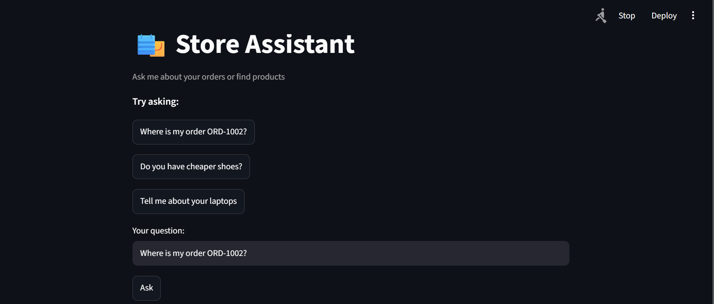
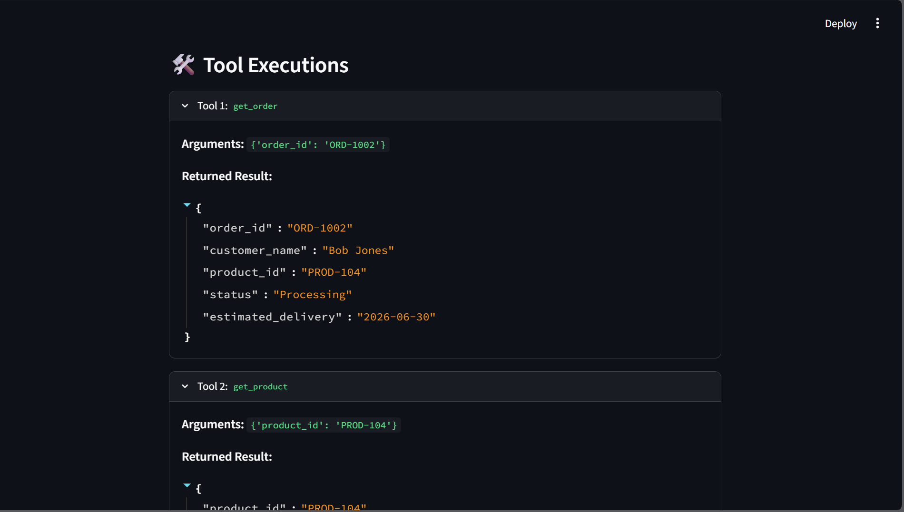
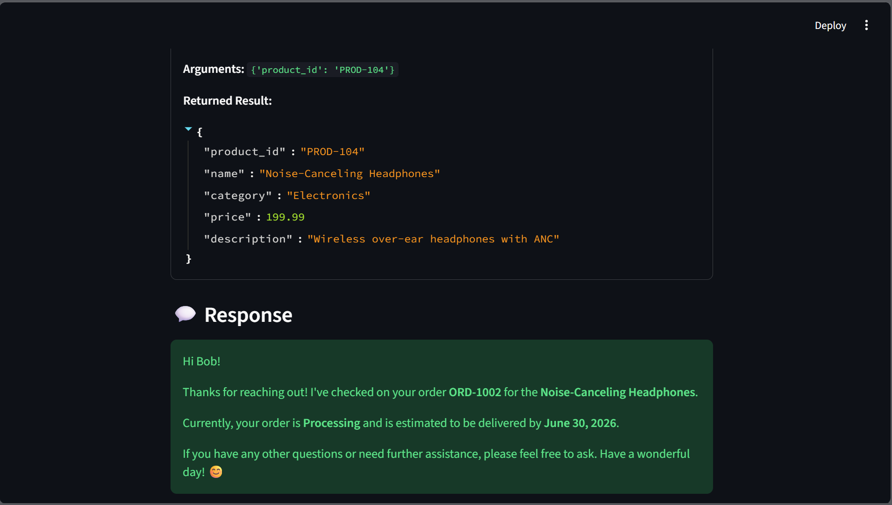
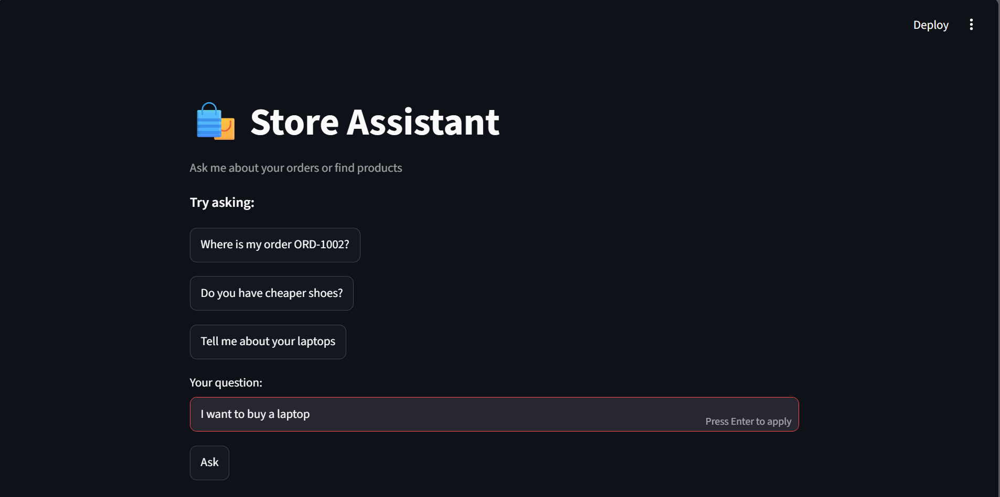
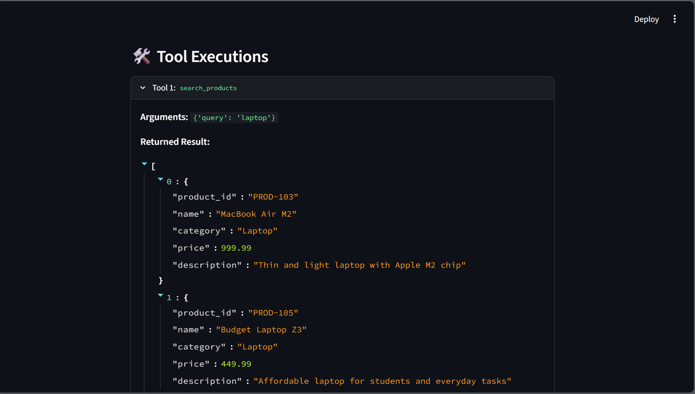
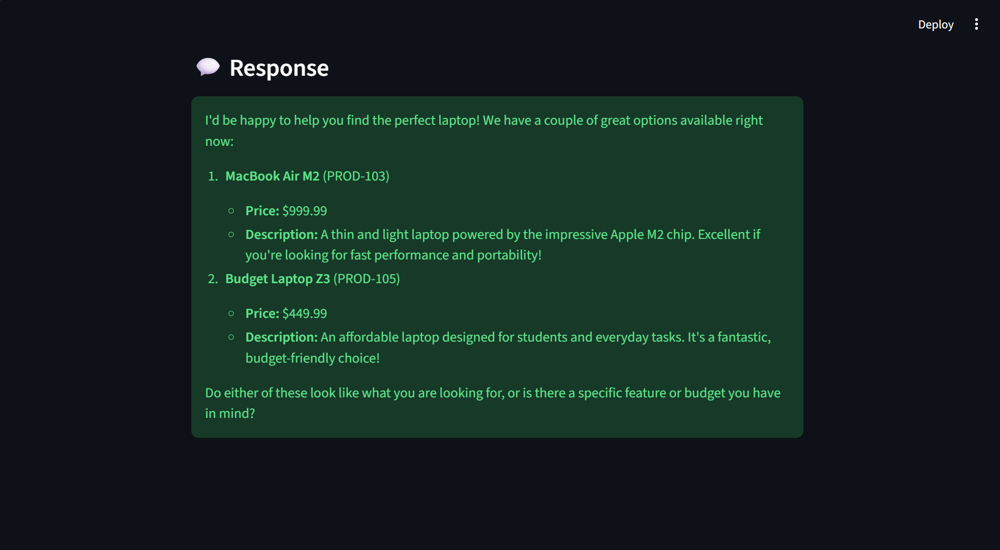

# 🛍️ Store Assistant Agent (LangChain & LangGraph Assignment)

This is an intelligent, stateful customer support chatbot agent for an online e-commerce store. It is built using **LangChain, LangGraph, and the Google Gemini API** (`gemini-3.5-flash`) to demonstrate modern AI agent patterns:

1. **State representation**: Managing conversation history and shared memory (`AgentState`) using LangGraph's message list with reducer append operations.
2. **Tool usage**: Exposing deterministic python helper functions as tools to the LLM using LangChain's `@tool` decorator.
3. **Tool chaining**: Allowing the model to autonomously chain tool executions based on intermediate outputs (e.g. retrieving an order, identifying its product ID, looking up its details, and searching for cheaper alternatives).
4. **Error handling**: Returning tool error responses back to the LLM as structured observations, enabling the model to explain issues gracefully rather than raising system exceptions.

---

## What This Project Does
The agent handles common e-commerce inquiries by routing them to appropriate tools:
- **Order Status Lookup**: Resolves orders (e.g., `ORD-1002`) to fetch customer details, product delivery status, and estimated delivery dates.
- **Product Information**: Looks up specifications of a product using its ID (e.g., `PROD-104`).
- **Product & Category Search**: Finds items based on keywords, category matching, or looks for cheaper alternative recommendations.

---

## Project Structure
```text
agentic-ai-assignment/
├── README.md               # Root documentation (this file)
└── ecommerce-agent/        # Core agent application
    ├── data.py             # Mock in-memory database representing orders and products
    ├── tools.py            # Python functions decorated as LangChain tools (get_order, search_products, etc.)
    ├── agent.py            # LangGraph state graph definition, LLM binding, and run_agent() execution loop
    ├── main.py             # Console entry point executing evaluation questions with rate limiting
    ├── test_agent.py       # Unit tests verifying tool logic and metadata registry
    ├── app.py              # Interactive Streamlit UI displaying user chat and tool call tracing
    ├── requirements.txt    # Project dependencies
    └── design_decisions.md # Detailed architectural write-up on LangChain/LangGraph decisions
```

---

## Project Scrrenshots






## Setup & Running the Code

### 1. Prerequisites
Ensure you have Python 3.10+ installed.

### 2. Install Dependencies
Change directory into `ecommerce-agent` and install all required packages from `requirements.txt`:
```bash
cd ecommerce-agent
pip install -r requirements.txt
```

### 3. Configure Environment Variables
Copy `.env.example` to a new `.env` file in the `ecommerce-agent` directory:
```bash
cp .env.example .env
```
Open `.env` and configure your Google API key:
```env
GOOGLE_API_KEY="your-gemini-api-key-here"
```

### 4. Running the Console Demo
This runs 5 preset customer questions to evaluate the agent's routing, chaining, and error recovery:
```bash
python main.py
```

### 5. Running the Unit Tests
Verify the underlying Python tool functions and metadata registration:
```bash
python -m unittest test_agent.py
```

### 6. Running the Streamlit Web Application
To interact with the chatbot in a beautiful browser interface with expandable, real-time tool execution logs:
```bash
streamlit run app.py
```

---

## Sample Execution Traces

### Example 1: Order Lookup (Tool Chaining)
* **User Input**: `"Where is my order ORD-1002?"`
* **Execution Flow**:
  1. `llm` node decides to run `get_order(order_id="ORD-1002")`.
  2. `tools` node executes the Python function and returns order details (customer name, product ID, status).
  3. `llm` node notices the order belongs to Bob Jones for `PROD-104`. It calls `get_product(product_id="PROD-104")` to retrieve product details.
  4. `tools` node returns the product name ("Noise-Canceling Headphones").
  5. `llm` node synthesizes the final message and returns it.
* **Agent Response**:
  > "Hi Bob Jones, your order ORD-1002 for the Noise-Canceling Headphones is currently Processing. It is estimated to arrive on 2026-06-30."

### Example 2: Finding Alternatives (Sorting & Logic)
* **User Input**: `"Is there a cheaper alternative to the shoes I ordered in ORD-1001?"`
* **Agent Response**:
  > "Your order ORD-1001 was for the **Running Shoes X1** ($89.99). I found the following cheaper alternatives in our footwear category:
  > - **Sport Sandals Pro** ($55.00)
  > - **Trail Running Shoes** ($75.00)"

---

## Architectural Details
For a deep dive into the design choices, State Graph architecture, nodes, edges, routing logic, and potential future improvements, see [design_decisions.md](ecommerce-agent/design_decisions.md).
